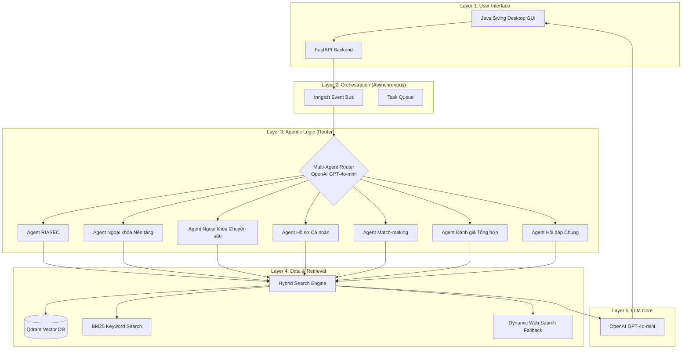

# Kiến trúc Hệ thống: Adaptive Agentic RAG (Advisory System)

Tài liệu này mô tả kiến trúc tầng nấc (Layered Architecture) của hệ thống RAG đa tác nhân thích ứng, phục vụ bài toán tư vấn định hướng ngoại khóa và chẩn đoán Holland (RIASEC).

## 1. Sơ đồ Kiến trúc Tổng quát

## 2. Các Tầng Kiến trúc Chi tiết

### 2.1 Tầng Điều phối Đa Tác nhân (Multi-Agent Layer)
Hệ thống sử dụng kiến trúc **Agentic Router** dựa trên mô hình ngôn ngữ lớn (LLM). Thay vì sử dụng một prompt duy nhất cho mọi câu hỏi, hệ thống phân loại ý định người dùng vào 7 tác nhân chuyên trách:
*   **Router:** Sử dụng OpenAI GPT-4o-mini để thực hiện `Zero-shot Intent Classification` với độ chính xác thực nghiệm đạt **95.24%**.
*   **Chuyên trách hóa:** Mỗi Agent sở hữu một `System Prompt` riêng biệt, được tối ưu hóa cho từng nghiệp vụ cụ thể (VD: chẩn đoán tâm lý RIASEC vs. tra cứu hồ sơ tuyển sinh).

### 2.2 Tầng Truy xuất Thích ứng (Adaptive Retrieval Layer)
Hệ thống kết hợp nhiều phương thức truy xuất để đảm bảo tính bao phủ (Recall) và độ chính xác (Precision):
*   **Hybrid Search:** Kết hợp `Dense Retrieval` (Vector Search qua Qdrant) và `Sparse Retrieval` (BM25 qua từ khóa).
*   **Dynamic Web Fallback:** Trong trường hợp kho dữ liệu tĩnh (PDF) không chứa thông tin, hệ thống tự động kích hoạt Crawler để tìm kiếm thông tin thời gian thực từ Internet (Tavily API).
*   **Reranking:** Sử dụng cơ chế tái xếp hạng để loại bỏ các đoạn văn bản có độ tương quan thấp trước khi đưa vào mô hình sinh.

### 2.3 Tầng Xử lý Trung tâm (LLM Core Layer)
*   **LLM Service:** Lớp trừu tượng hóa (`llm_service.py`) quản lý các yêu cầu tới mô hình ngôn ngữ lớn, đảm bảo tính ổn định và tốc độ xử lý câu hỏi.
*   **OpenAI GPT-4o-mini:** Được chọn làm engine chính nhờ sự cân bằng giữa chi phí, tốc độ và khả năng suy luận logic vượt trội.

## 3. Luồng Dữ liệu (Data Flow)

1.  **Input:** Người dùng nhập câu hỏi qua giao diện Java GUI (Native macOS).
2.  **Routing:** Router phân tích và chọn Agent phù hợp nhất.
3.  **Expansion:** Câu hỏi được viết lại (Query Rewriting) để tăng hiệu quả tìm kiếm.
4.  **Retrieval:** Thực hiện tìm kiếm lai trên Qdrant và BM25.
5.  **Generation:** OpenAI tổng hợp câu trả lời kèm trích dẫn nguồn `[n]`.
6.  **Output:** Kết quả được stream về phía người dùng theo thời gian thực (SSE).

---
*Tài liệu này được cập nhật vào tháng 5/2026 phản ánh kiến trúc thực tế của hệ thống.*

